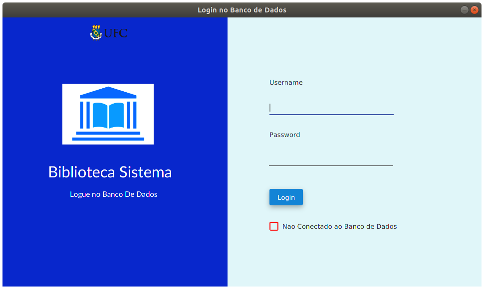
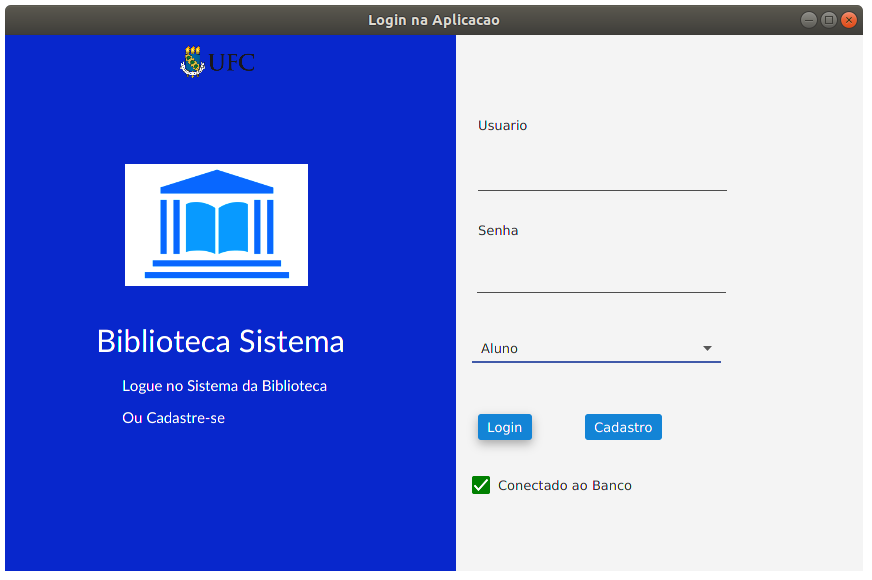
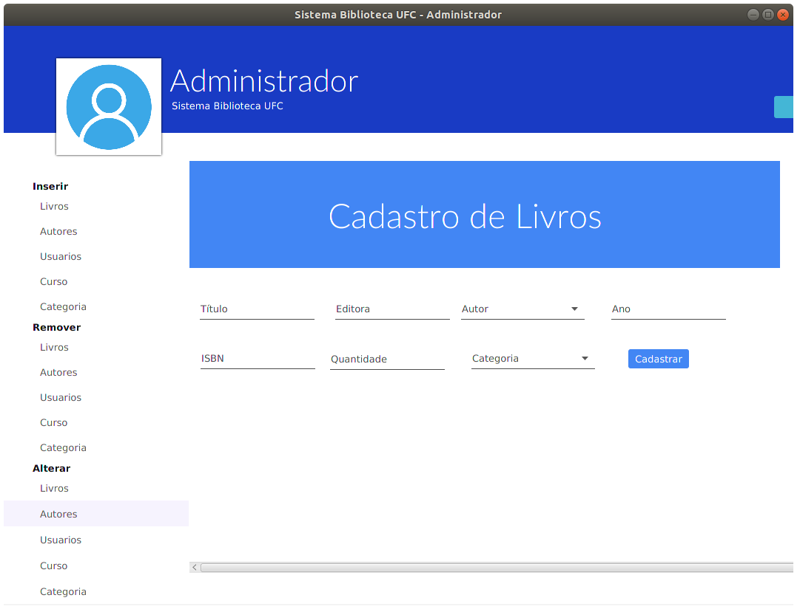
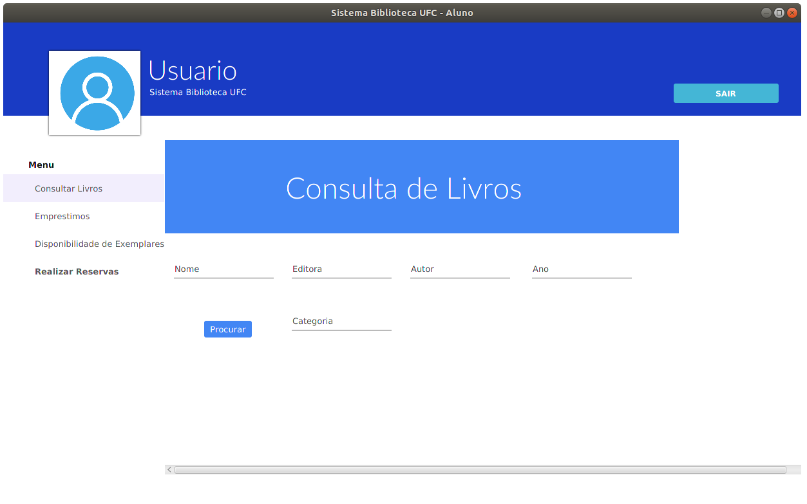
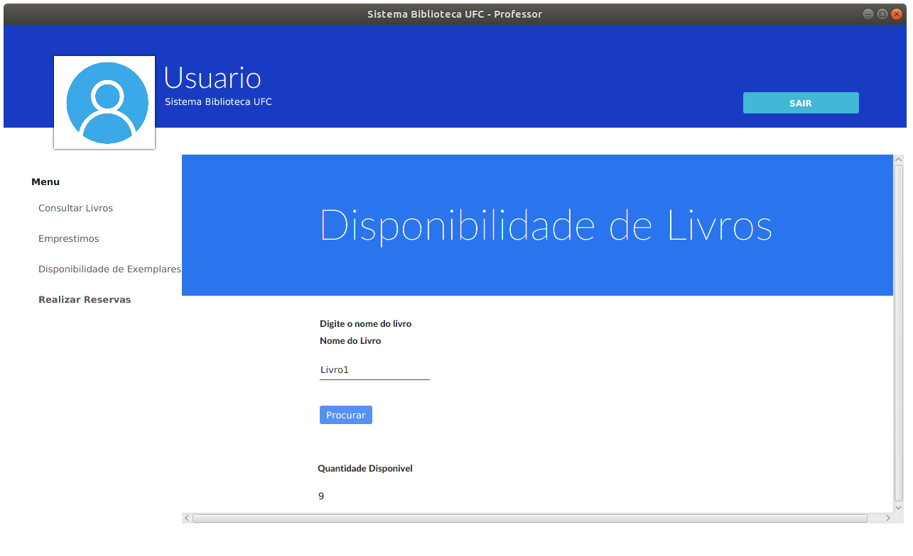
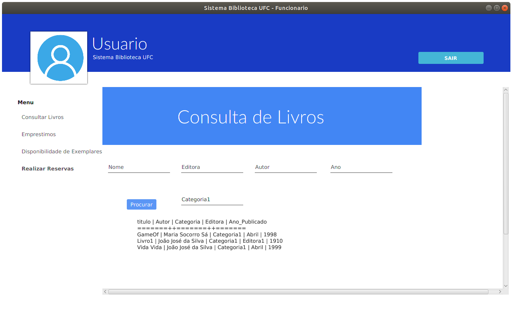

# Sistema Biblioteca UFC
---
<<<<<<< HEAD

##### Observações
> a modelagem nao esta igual ao script de povoamento, use o script para criar o banco.
=======
### Observações
:pushpin: Modelagem nao esta igual ao script de povoamento, use o script para criar o banco.  
:pushpin: Admin connection in progress
>>>>>>> a0c3ac1e38c0c82c6667a4b20353ede83ad31342

## Começando
As instruções abaixo, apesar de ainda em construção, vai guiá-lo para preparar todo o ambiente e rodar na sua máquina a aplicação, independente do sistema operacional que estiver usando.

1. Baixe e instale o MySQL pelo link na sessão de pré-requisitos; 
2. Crie o banco com o script de povoamento;
2. Use os arquivos .sql para criar as triggers e procedures;
3. Baixe e instale a JDK8 pelo link na sessão de pré-requisitos;
4. Baixe e instale sua IDE de preferência. Recomendamos o NetBeans para fácil importação do projeto. Link na sessao de pré-requisitos;
5. Baixe o ZIP do projeto e importe no NetBeans. Arquivos -> Importar Projeto -> de ZIP;
6. Siga as intruções que aparecerão na tela para adicionar as bibliotecas .jar. que se encontram dentro do .ZIP do projeto. /dist -> lib
7. Pronto! Execute o projeto.

##### Observações
> a modelagem nao esta igual ao script de povoamento, use o script para criar o banco.

## Pré-requisitos
* [NetBeans](https://netbeans.org/downloads/)
> ou sua IDE de preferência, mas mostraremos com essa.
* [JDK 8](https://www.oracle.com/technetwork/java/javase/downloads/jdk8-downloads-2133151.html)
> contendo o compilador Java e suas API's.
* [MySQL 5.7](https://dev.mysql.com/downloads/windows/installer/5.7.html)
> installer do MySQL.
* [JDBC Driver MySql](https://dev.mysql.com/downloads/connector/j/)
> driver para conexão da aplicação com o banco.
* [JFoenix](https://github.com/jfoenixadmin/JFoenix) 
> usado em alguns componentes do fxml

* JavaFx

## Screens

### Tela de login do banco.
###### Use as credenciais do seu banco MySql

### Tela de login da aplicação
###### Lembre-se de escolher o tipo de acesso correto
###### aluno, professor, funcionario ou bibliotecário.
###### administrador é com login e senha (admin, root)
  

### Tela de administrador.
###### Falta adicionar algumas telas dos botões

### Tela de Usuario
###### Semelhante para todos os usuários, as alterações se dão em alguns privilégios para cada usuário.

## Autores
* **Breno Campos**

<!-- talvez tenha que adicionar o FontAwesoneFX -->
